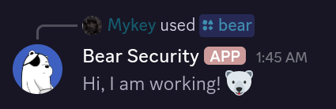
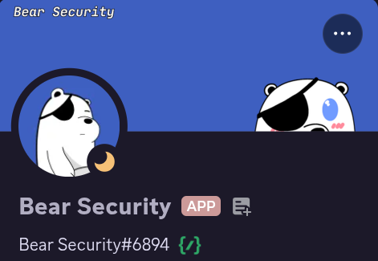

# Bear Sec Bot

Bear Sec Bot is a Discord bot built with `discord.py` that provides various commands and features. This guide will help you set up and run the bot using Nix and `flake.nix`.


## Prerequisites

1. Install [Nix](https://nixos.org/download.html) on your system.
2. Ensure you have a Discord bot token. You can create one by following the [Discord Developer Portal guide](https://discord.com/developers/docs/getting-started).

## Setup Instructions

### 1. Clone the Repository

```bash
git clone <repository-url>
cd Bear Sec
```

### 2. Configure the Environment

1. Copy the `.env.example` file to `.env`:

   ```bash
   cp .env.example .env
   ```

2. Open the `.env` file and set your `DISCORD_TOKEN`:

   ```plaintext
   DISCORD_TOKEN=your-bot-token-here
   ```

### 3. Enter the Development Shell

Use the `flake.nix` file to enter a development shell with all dependencies:

```bash
nix develop
```

This will set up a shell environment with Python and all required packages.

### 4. Run the Bot

Run the bot using Python:

```bash
python bot.py
```

If everything is set up correctly, the bot will connect to Discord and sync its commands.

## Features

- **/ping**: Check the bot's latency and uptime.
- **/bear**: Verify that the bot is working.

## Screenshots

Below are screenshots of the bot in action:

### Bot Status


### Bear Command


### Bot Profile


## Troubleshooting

- Ensure your `DISCORD_TOKEN` is correctly set in the `.env` file.
- If dependencies are missing, ensure you are using the development shell provided by `flake.nix`.

